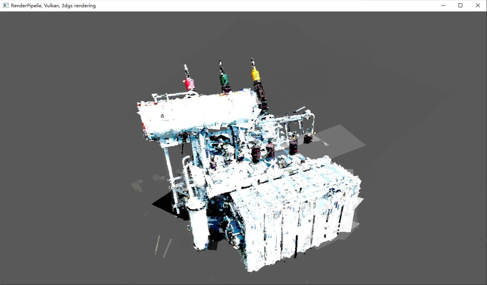

# RenderPipeline 
RenderPipeline is an open-source implementation of the book 'Real-Time Graphics Rendering Engine' (《实时图形绘制引擎技术》) framework.

# Table of contents

- [Overview](#Overview)
- [Samples](#Samples)
- [Implementations](#implementations)
- [Architecture](#Architecture)
  - [RenderEngine](#RenderEngine)
  - [RenderUnit](#RenderUnit)
  - [PreRender](#PreRender)
  - [RenderPipeline](#RenderPipeline)
- [Resource](#Resource)
- [License](#License)

# Overview
* graphic: vulkan
* framework: render pipeline

# Samples
## obj/gltf models
 

## splat 3dgs models
|  |  |
|:------------------------------------------:|:------------------------------------------:|
| 图1: 基础点云形态                           | 图2: 四边形混合前效果                      |

|  |  |
|:------------------------------------------:|:------------------------------------------:|
| 图3: 四边形混合后效果                      | 图4: 球体无序混合效果                      |
# Todo

### vulkan
- [x] Device: VkInstance, VkPhysicalDevice, VkDevice, VkQueue
- [x] Swapchain: VkSwapchainKHR, VkImage, VkImageView, VkFramebuffer, VkRenderPass
- [x] Texture: VkImage, VkImageView, VkDeviceMemory, VkSampler
- [x] Buffer: VkBuffer, VkDeviceMemory
- [x] Graphic Pipeline: VkPipeline, VkPipelineLayout, VkDescriptorSetLayout, VkDescriptorSet, VkShaderModule
- [x] Computer Pipeline: VkPipeline, VkPipelineLayout, VkDescriptorSetLayout
- [x] Shader: Vertex shader, Geometry shader, Fragment shader, Compute shader
### framework
- [ ] RenderPipeline
- [ ] PreRender
  - [ ] NodeClassify
- [ ] RenderModule
- [ ] RenderQueue
- [ ] RenderTarget
- [ ] RHIResource, RHIResourceManager
- [ ] Scene, SGNode, MeshBuilder, Mesh, Material
  - [ ] MeshBuilder
  - [ ] SceneBuilder
### model files
- [x] obj
- [x] gltf
- [ ] 3dgs
  - [x] Load .splat file
  - [x] projection (compute shader)
  - [x] drawing quad (geometry shader)
  - [x] color blending
  - [ ] sort splat
  - [ ] optimize: computer shader parser
### samples
- [x] model
- [ ] 3dgs
- [ ] ray tracer

# Architecture

## RenderEngine
 

## RenderUnit
 

## PreRender
 

## RenderPipeline
 

# Resource
* [vulkan](https://github.com/SaschaWillems/Vulkan): C++ examples for the Vulkan graphics API.
* [vulkan tutorial](https://github.com/Overv/VulkanTutorial): Tutorial for the Vulkan graphics and compute API.
* [vulkan 3dgs](https://github.com/jaesung-cs/vkgs): Vulkan-based Gaussian Splatting viewer.
* [tinygltf](https://github.com/syoyo/tinygltf): Header only C++11 tiny glTF 2.0 library
* [tinyobjloader](https://github.com/tinyobjloader/tinyobjloader): Tiny but powerful single file wavefront obj loader

# License

The main project is licensed under MIT.

This project uses several third-party libraries. Here is a list of these libraries along with their respective licenses:

- **GLM**: [MIT License](https://opensource.org/licenses/MIT).
- **ImGUI**: [MIT License](https://opensource.org/licenses/MIT).
- **VkRadixSort**: [MIT License](https://opensource.org/licenses/MIT).
- **glfw**: [zlib/libpng license](https://www.glfw.org/license.html).
- **tinygltf**: [MIT License](https://www.glfw.org/license.html).
- **tinyobjloader**: [MIT License](https://www.glfw.org/license.html).